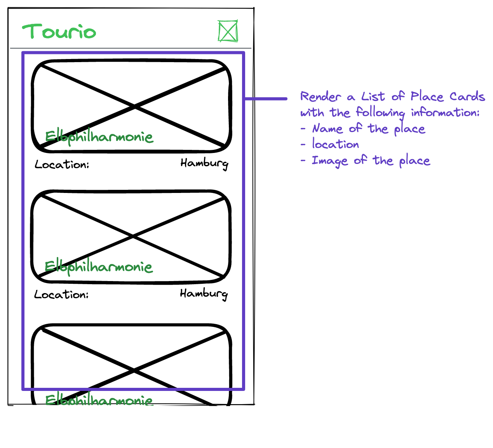
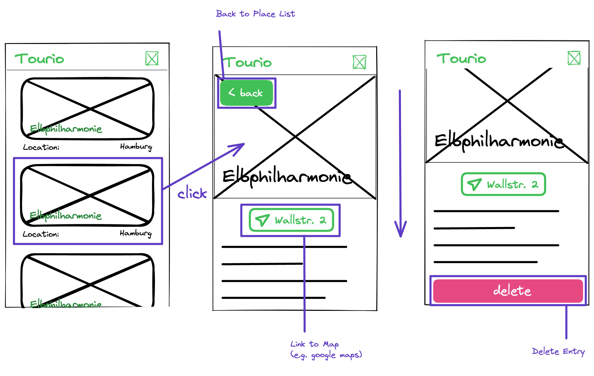
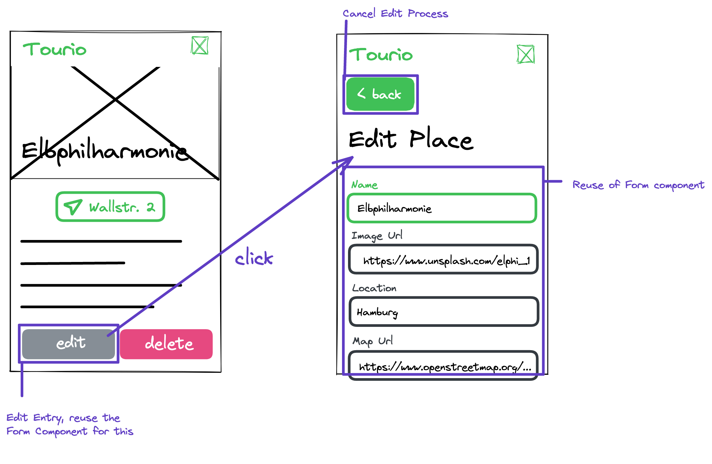

# Recap Project 6 - Tourio

In this project you are going to create a tour attraction app, where you can display, create, update and delete attraction entries in your own MongoDB database. So lets jump right in with the first userstory!

---

## Userstory 1 - First Look

### Value Proposition

**As a** User,

**I want to** be able to see the attractions available,

**so that** I can get an overview of all places.

### Description

> 💡 Only create the frontend from static data here

### Acceptance Criteria

- [ ] All places from the [static JSON](./lib/db.json) are displayed as cards
- [ ] In a card, the name of the place is displayed
- [ ] In a card, the image of the place is displayed
- [ ] In a card, the location is displayed
- [ ] The title of the app is always visible in the title bar

### Tasks

- [ ] Map over the example places from the JSON to design the cards
- [ ] Create the title bar component
- [ ] Create a card component displaying the required elements

---

## Userstory 2 - Adding backend

### Value Proposition

**As a** User,

**I want to** share the same data from a database,

**so that** I can see all my places on different devices.

### Description

### Acceptance Criteria

- [ ] All places from the database are displayed as cards
- [ ] In a card, the name of the place is displayed
- [ ] In a card, the image of the place is displayed
- [ ] In a card, the location is displayed
- [ ] The title of the app is always visible in the title bar

### Tasks

- [ ] Create database on [MongoDB Atlas](https://atlas.mongodb.com)
- [ ] Prepare the database connection
- [ ] Create a database function to `find` all places
- [ ] Create an api endpoint in your `api/places` route for fetching all places from the database
- [ ] Map over the fetched places to render the cards

---

## Userstory 3 - Add new places

### Value Proposition

**As a** User,

**I want to** be able to add new places,

**so that** I can expand the places collection.

### Description

### Acceptance Criteria

- [ ] A Link to the create page is displayed as a hovering button on the main page
- [ ] On the create page, a back link to the main page is displayed at the top of the page
- [ ] A name input is displayed
- [ ] An image url input is displayed
- [ ] A location input is displayed
- [ ] A map url input is displayed
- [ ] A description textarea is displayed
- [ ] A submit button is displayed on the bottom of the page
- [ ] When clicking on the submit button, a new place document is created in the database and the user is redirected to the main page

### Tasks

- [ ] Create a Link component for the "add page" and "back" link
- [ ] Create a form component rendering all input fields and the submit button inside a form element, which is expecting a "onSubmit" prop
- [ ] Add the "onSubmit" prop as the callback function for the submit event of the form
- [ ] Add a create folder with an index.js for the create page
- [ ] Create a page component in this file which uses the form component for rendering the input fields
- [ ] Write a handleSubmit function which expects a submit event object
- [ ] Inside this function, send a `POST` request to the `api/places` api endpoint with the new place data in the body
- [ ] Expand the api endpoint to handle `POST` requests
- [ ] With the received data, create a new place document in the mongoDB
- [ ] In the handleSubmit function, reroute the user to the main page after a successful `POST` request

---

## Userstory 4 - Attraction details

### Value Proposition

**As a** User,

**I want to** to see more information about places,

**so that** I can decide if I want to go to this place.

### Description

### Acceptance Criteria

- [ ] If a card is clicked, the user will see a details page
- [ ] The place details page displays the name of the place
- [ ] The place details page displays the image of the place
- [ ] The place details page displays the location of the place
- [ ] The place details page displays the description of the place
- [ ] User can return to places list by clicking the back link
- [ ] User can click on the location link to see the attraction on google maps

### Tasks

- [ ] Add a places folder in the pages folder containing a `[id].js`
- [ ] Create an api endpoint in your `api/places/[id]` route for fetching the specific place from the database with a GET request
- [ ] Create a page component in this file which displays the requested elements by fetching the necessary place data from that api endpoint

---

## Userstory 5

### Value Proposition

**As a** User,

**I want to** delete attractions from my places list,

**so that** I can remove places that I do not want to visit anymore.

### Description

### Acceptance Criteria

- [ ] A delete button is shown at the end of the places details page
- [ ] If the delete button is clicked, the user will be redirected to the places list page
- [ ] The attraction is removed from the database

### Tasks

- [ ] Create a delete button
- [ ] Write an onClick function which triggers a DELETE request to the api endpoint `/api/places/[id]`
- [ ] Create a database function to handle this `delete` request
- [ ] On a successful delete, reroute the user to the main page

---

## Userstory 6

### Value Proposition

**As a** User,

**I want to** edit my places information,

**so that** the information about my attractions is always up to date.

### Description

### Acceptance Criteria

- [ ] An edit button is displayed next to the delete button
- [ ] If the edit button is clicked, the user is rerouted to an edit page where they can edit the information about the attraction
- [ ] The edit page reuses the form component from the create page
- [ ] The form is prefilled with the current data about the attraction in the corresponding input fields
- [ ] A backlink leads to the details page and cancels the edit process
- [ ] By clicking on the "edit" button, the place document is updated in the database
- [ ] After editing the informations, the user is redirected to the details page

### Tasks

- [ ] Reuse the Link component for the "back" link
- [ ] Refactor the `pages/places/[id].js` file into a dynamic folder with an `index.js`: `pages/places/[id]/index.js`
- [ ] Add an `edit.js` in the `[id]` folder
- [ ] Create a page component in this file which reuses the form component for rendering the input fields
- [ ] If necessary, update the form component so that the current data of the attraction is already displayed as default values
- [ ] If necessary, update the form component to expect props like `onCancel`, `onSubmit`, `titleText`, `submitButtonText`
- [ ] Write a handleSubmit function which expects a submit event object
- [ ] Inside this function, send a `PATCH` request to the `api/places/[id]` api endpoint with the new place data in the body
- [ ] Update the api endpoint to handle `PATCH` requests
